# Architecture Diagrams

This document contains architecture diagrams for the GraphRAG + ReAct Knowledge Retrieval System.

---

## 1. High-Level System Architecture

```mermaid
flowchart TB
    subgraph Sources["📁 DATA SOURCES"]
        PST["📧 PST Files<br/>35 years emails"]
        PDF["📄 PDF Documents"]
        DOCX["📝 DOCX Files"]
        XLSX["📊 XLSX Spreadsheets"]
        PPTX["📽️ PPTX Presentations"]
    end

    subgraph Bronze["🥉 BRONZE LAYER<br/>Raw Data"]
        B1["bronze/emails/"]
        B2["bronze/documents/"]
        B3["bronze/attachments/"]
        B4["bronze/metadata/"]
    end

    subgraph Silver["🥈 SILVER LAYER<br/>Cleaned & Enriched"]
        S1["silver/chunks/"]
        S2["silver/chunks_anonymized/"]
        S3["silver/ner_results/"]
        S4["silver/summaries/"]
        S5["silver/entities_raw/"]
    end

    subgraph Gold["🥇 GOLD LAYER<br/>Business-Ready"]
        G1["gold/entities/"]
        G2["gold/relationships/"]
        G3["gold/communities/"]
        G4["gold/community_summaries/"]
        G5["gold/chunks_embedded/"]
        G6["gold/evaluation_results/"]
    end

    subgraph Azure["☁️ AZURE SERVICES"]
        AOA["🤖 Azure OpenAI<br/>GPT-4o + Embeddings"]
        AIS["🔍 Azure AI Search<br/>HNSW Vector Index"]
        CDB["🌐 Cosmos DB<br/>Gremlin Graph"]
        ADB["⚡ Databricks<br/>Spark Processing"]
    end

    Sources --> Bronze
    Bronze --> Silver
    Silver --> Gold
    Gold <--> Azure

    style Bronze fill:#CD7F32,stroke:#8B4513,color:#fff
    style Silver fill:#C0C0C0,stroke:#808080,color:#000
    style Gold fill:#FFD700,stroke:#B8860B,color:#000
    style Azure fill:#dae8fc,stroke:#6c8ebf
```

---

## 2. Medallion Architecture Detail

```mermaid
flowchart LR
    subgraph Phase1["PHASE 1-2"]
        direction TB
        I1["PST Extraction"]
        I2["Document Parsing"]
        I3["Language Detection"]
        I4["Semantic Chunking"]
        I5["NER + PII"]
        I6["Summarization"]
    end

    subgraph Phase3["PHASE 3-4"]
        direction TB
        P1["Embeddings<br/>text-embedding-3-large"]
        P2["HNSW Indexing"]
        P3["Entity Extraction<br/>GPT-4o"]
        P4["Graph Building<br/>Cosmos DB"]
        P5["Community Detection<br/>Leiden"]
        P6["Community Summaries"]
    end

    subgraph Phase5["PHASE 5-6"]
        direction TB
        A1["Query Classification"]
        A2["GraphRAG Retriever"]
        A3["ReAct Agent"]
        A4["RAGAS Evaluation"]
        A5["Statistical Analysis"]
        A6["Final Report"]
    end

    B[("🥉 BRONZE<br/>Raw Data")]
    S[("🥈 SILVER<br/>Processed")]
    G[("🥇 GOLD<br/>Ready")]

    Phase1 --> B
    B --> S
    Phase3 --> S
    S --> G
    Phase5 --> G
```

---

## 3. GraphRAG Retrieval Pipeline

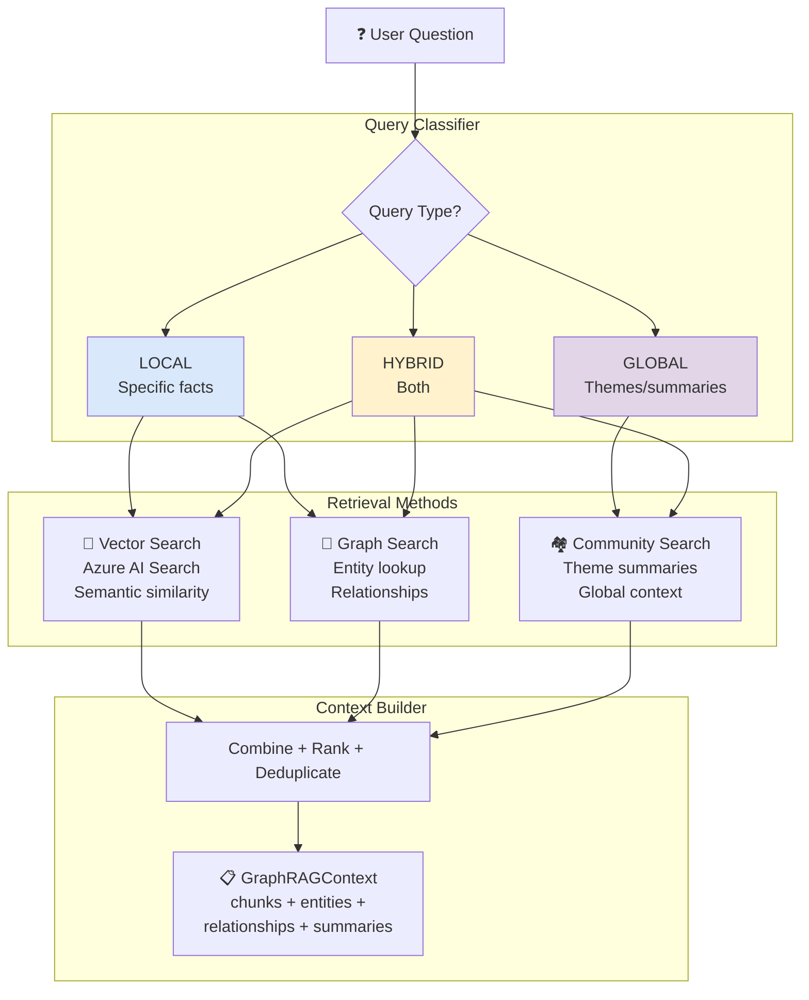

---

## 4. ReAct Agent Architecture

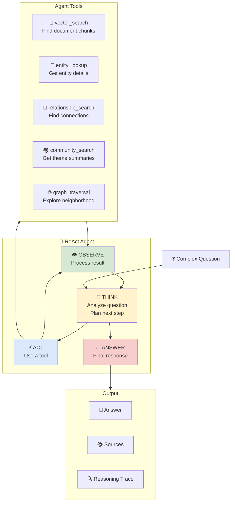

---

## 5. Multi-Hop Question Example

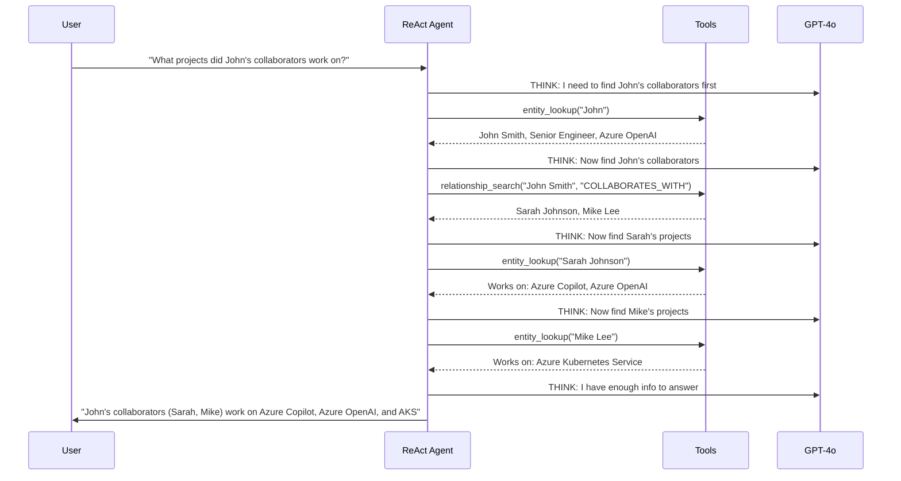

---

## 6. User Interface

```mermaid
flowchart LR
    subgraph Users["👤 Users"]
        U1["Knowledge Worker"]
        U2["Analyst"]
        U3["Manager"]
        U4["Developer"]
    end

    subgraph Interfaces["🖥️ Interface Options"]
        I1["💬 Chat Interface<br/>Natural Language<br/>Conversational Q&A"]
        I2["🔌 REST API<br/>Programmatic Access<br/>App Integration"]
        I3["📓 Databricks Notebook<br/>Interactive Exploration<br/>Ad-hoc Analysis"]
    end

    subgraph System["⚙️ GraphRAG + ReAct System"]
        S1["Query Classification"]
        S2["Retrieval Pipeline"]
        S3["ReAct Agent"]
    end

    subgraph Response["✅ Response"]
        R1["📝 Answer"]
        R2["📚 Sources"]
        R3["🔍 Reasoning Trace"]
        R4["🔗 Related Entities"]
    end

    Users --> Interfaces
    Interfaces --> System
    System --> Response
    Response --> Users

    style I1 fill:#dae8fc
    style I2 fill:#e1d5e7
    style I3 fill:#fff2cc
```

---

## 7. End-to-End User Interaction

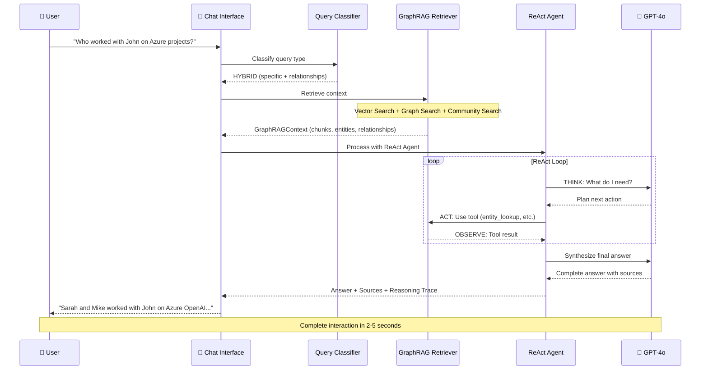

---

## 8. Data Flow Diagram

```mermaid
flowchart LR
    subgraph Input["Input Data"]
        D1["10-15 GB<br/>PST + Documents"]
    end

    subgraph P1["Phase 1"]
        A1["Extract Text"]
        A2["Detect Language"]
    end

    subgraph P2["Phase 2"]
        B1["Chunk (512-1024 tokens)"]
        B2["NER (EN/NL)"]
        B3["Anonymize PII"]
        B4["Summarize"]
    end

    subgraph P3["Phase 3"]
        C1["Generate Embeddings"]
        C2["Create HNSW Index"]
        C3["Basic RAG"]
    end

    subgraph P4["Phase 4"]
        D1a["Extract Entities"]
        D2["Build Graph"]
        D3["Detect Communities"]
        D4["Summarize Communities"]
    end

    subgraph P5["Phase 5"]
        E1["Combined Retriever"]
        E2["ReAct Agent"]
        E3["User Interface"]
    end

    Input --> P1 --> P2 --> P3 --> P4 --> P5
```

---

## 9. Knowledge Graph Structure

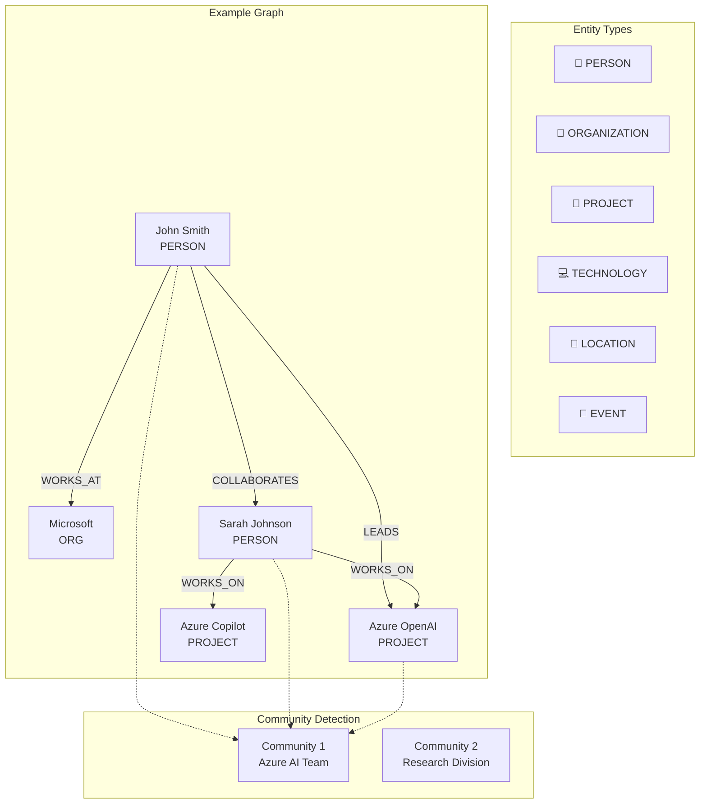

---

## 10. Azure Architecture

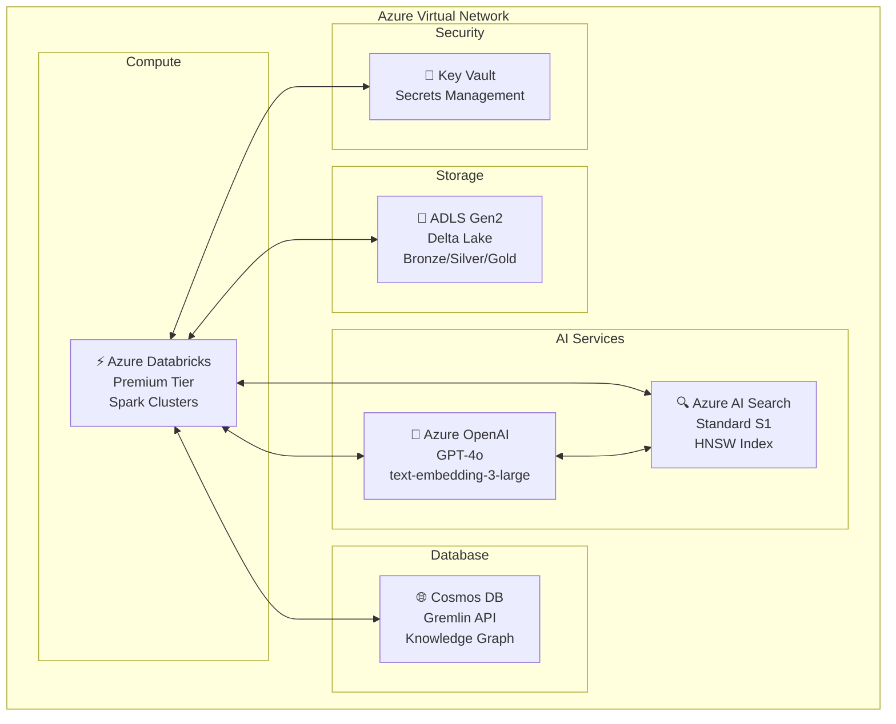

---

## 11. Execution Timeline

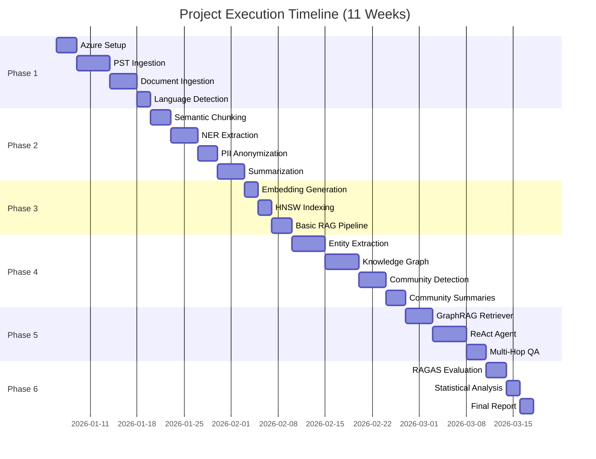

---

## How to Use These Diagrams

### Draw.io

1. Open [draw.io](https://app.diagrams.net/)
2. File → Open → Select `architecture_diagram.drawio`
3. Edit as needed
4. Export as PNG/SVG for thesis

### Mermaid (This File)

1. These diagrams render automatically in:
   - GitHub markdown preview
   - VS Code with Mermaid extension
   - Obsidian
   - Many documentation tools

2. To export as images:
   - Use [Mermaid Live Editor](https://mermaid.live/)
   - Paste the code
   - Download as PNG/SVG

### For Thesis (LaTeX)

1. Export diagrams as PNG or SVG
2. Include in LaTeX:
   ```latex
   \begin{figure}[h]
       \centering
       \includegraphics[width=0.9\textwidth]{figures/architecture.png}
       \caption{GraphRAG + ReAct System Architecture}
       \label{fig:architecture}
   \end{figure}
   ```

---

*GraphRAG + ReAct Knowledge Retrieval System*
*KU Leuven Master Thesis - Muhammad Rafiq*
