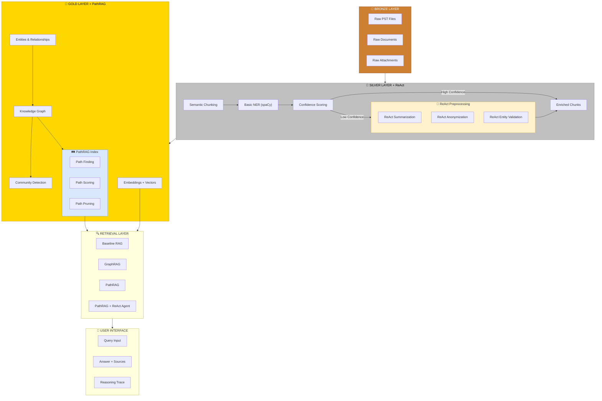
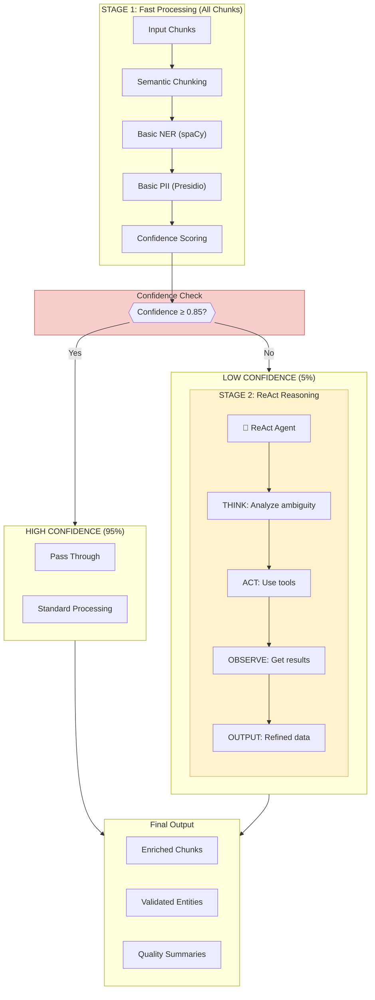
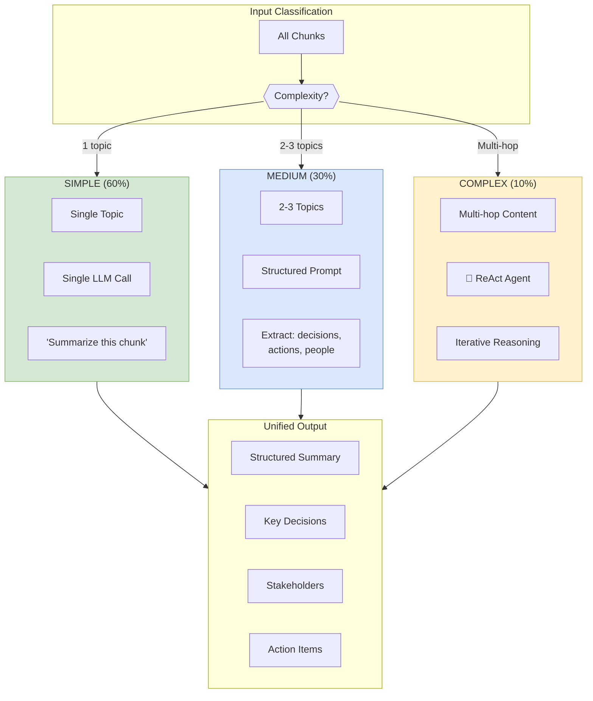
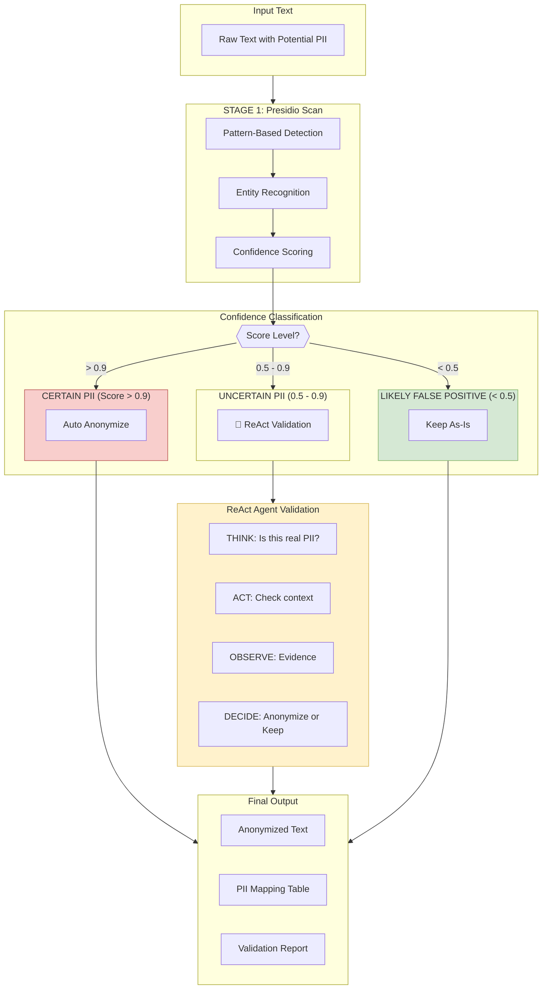
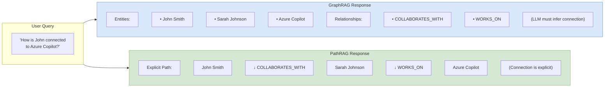
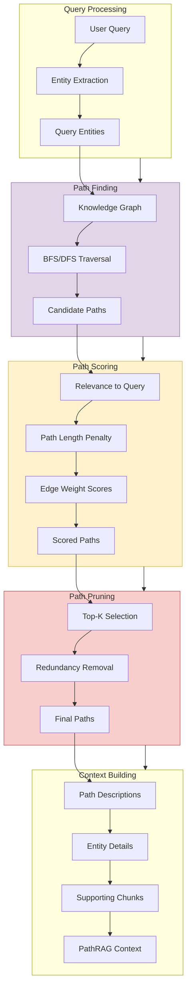
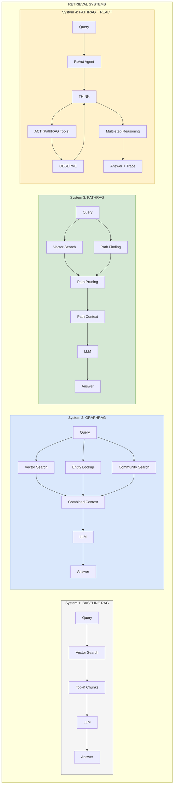
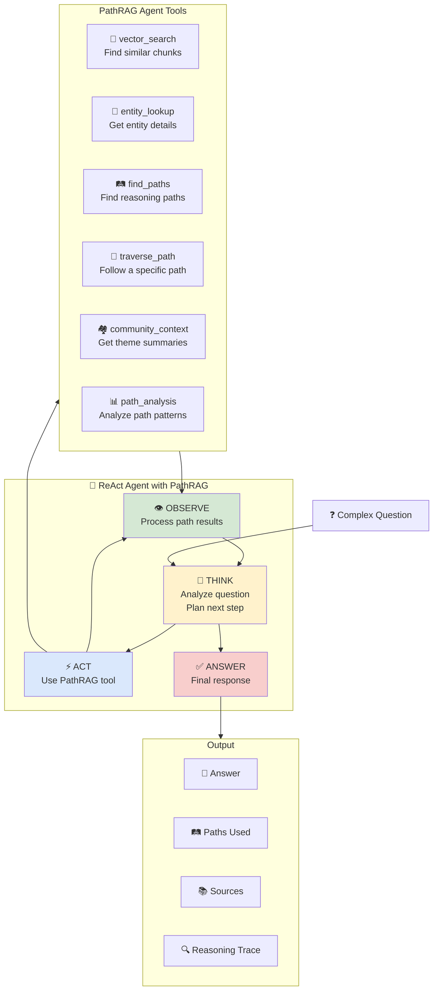
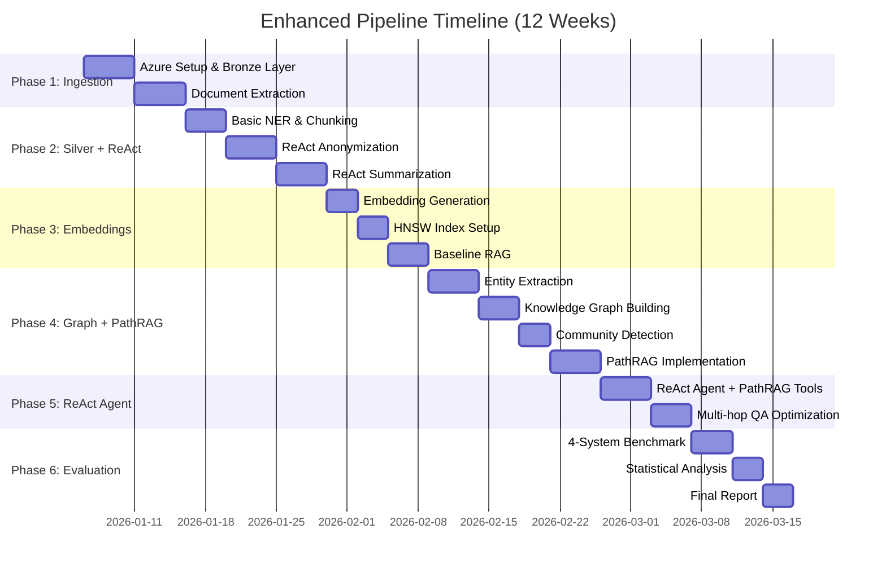

# Enhanced Architecture: PathRAG + ReAct-Assisted Preprocessing

This document describes the enhanced pipeline architecture that integrates:
1. **ReAct-Assisted Preprocessing** - Agentic reasoning for summarization and anonymization
2. **PathRAG** - Path-based retrieval for better multi-hop reasoning

---

## 1. Architecture Overview



---

## 2. ReAct-Assisted Silver Layer

### 2.1 Processing Flow



### 2.2 ReAct Preprocessing Tools

| Tool | Purpose | When Used |
|------|---------|-----------|
| `search_document_context` | Search surrounding text for entity clarification | Ambiguous entity names |
| `verify_entity_type` | Verify if entity is PERSON, ORG, or other | Unclear entity types |
| `check_pii_context` | Determine if text is real PII or false positive | Uncertain PII matches |
| `cross_reference_entities` | Check if two mentions refer to same entity | Entity resolution |
| `validate_relationship` | Verify if extracted relationship is valid | Relationship extraction |

### 2.3 Tool Definitions

```python
PREPROCESSING_TOOLS = [
    {
        "name": "search_document_context",
        "description": "Search surrounding text within the document for entity clarification",
        "parameters": {
            "entity": "The entity text to search context for",
            "window_size": "Number of sentences to include (default: 5)"
        }
    },
    {
        "name": "verify_entity_type",
        "description": "Verify if an entity is PERSON, ORGANIZATION, PRODUCT, or other type",
        "parameters": {
            "entity": "The entity text to verify",
            "candidate_types": "List of possible entity types"
        }
    },
    {
        "name": "check_pii_context",
        "description": "Determine if detected text is real PII or a false positive",
        "parameters": {
            "text": "The potential PII text",
            "pii_type": "Type of PII (PERSON, EMAIL, PHONE, etc.)",
            "context": "Surrounding text for analysis"
        }
    },
    {
        "name": "cross_reference_entities",
        "description": "Check if two entity mentions refer to the same real-world entity",
        "parameters": {
            "entity1": "First entity mention",
            "entity2": "Second entity mention",
            "context1": "Context of first mention",
            "context2": "Context of second mention"
        }
    },
    {
        "name": "validate_relationship",
        "description": "Verify if an extracted relationship between entities is valid",
        "parameters": {
            "source_entity": "Source entity of relationship",
            "relationship_type": "Type of relationship",
            "target_entity": "Target entity of relationship",
            "evidence": "Text evidence for the relationship"
        }
    }
]
```

---

## 3. ReAct-Assisted Summarization

### 3.1 Three-Tier Summarization Strategy



### 3.2 ReAct Summarization Example

```
INPUT: Complex email thread (15 messages, 5 participants, multiple topics)

┌─────────────────────────────────────────────────────────────────────┐
│ THINK: This is a long thread with multiple participants.           │
│        I need to identify the main topics first.                   │
├─────────────────────────────────────────────────────────────────────┤
│ ACT: extract_topics(thread)                                        │
├─────────────────────────────────────────────────────────────────────┤
│ OBSERVE: Topics identified:                                        │
│   1. Budget approval request                                       │
│   2. Timeline concerns                                             │
│   3. Resource allocation                                           │
│   4. Vendor selection                                              │
├─────────────────────────────────────────────────────────────────────┤
│ THINK: Multiple decisions might have been made. Let me find them.  │
├─────────────────────────────────────────────────────────────────────┤
│ ACT: find_decisions(thread)                                        │
├─────────────────────────────────────────────────────────────────────┤
│ OBSERVE: Decisions found:                                          │
│   - APPROVED: Budget of $50,000                                    │
│   - APPROVED: Vendor A selected                                    │
│   - PENDING: Timeline needs stakeholder review                     │
├─────────────────────────────────────────────────────────────────────┤
│ THINK: Who are the key decision makers and stakeholders?           │
├─────────────────────────────────────────────────────────────────────┤
│ ACT: identify_stakeholders(thread)                                 │
├─────────────────────────────────────────────────────────────────────┤
│ OBSERVE: Stakeholders:                                             │
│   - John Smith (Budget Approver)                                   │
│   - Sarah Johnson (Project Lead, Requester)                        │
│   - Mike Lee (Technical Lead)                                      │
│   - Lisa Chen (Procurement)                                        │
├─────────────────────────────────────────────────────────────────────┤
│ THINK: Now I have enough information to create a structured        │
│        summary covering all key aspects.                           │
├─────────────────────────────────────────────────────────────────────┤
│ OUTPUT:                                                            │
│                                                                    │
│ SUMMARY:                                                           │
│ Email thread discussing Q3 project budget and vendor selection.    │
│ Budget of $50,000 approved by John Smith. Vendor A selected after  │
│ technical review by Mike Lee. Timeline pending final review.       │
│                                                                    │
│ DECISIONS:                                                         │
│ - Budget: $50,000 approved                                         │
│ - Vendor: Vendor A selected                                        │
│                                                                    │
│ PENDING:                                                           │
│ - Timeline finalization (awaiting stakeholder input)               │
│                                                                    │
│ STAKEHOLDERS:                                                      │
│ - John Smith (Approver)                                            │
│ - Sarah Johnson (Lead)                                             │
│ - Mike Lee (Technical)                                             │
└─────────────────────────────────────────────────────────────────────┘
```

### 3.3 Summarization Tools

```python
SUMMARIZATION_TOOLS = [
    {
        "name": "extract_topics",
        "description": "Extract main topics/themes from a document or thread",
        "parameters": {
            "text": "The text to analyze",
            "max_topics": "Maximum number of topics to extract (default: 5)"
        }
    },
    {
        "name": "find_decisions",
        "description": "Identify decisions made in the text (approved, rejected, pending)",
        "parameters": {
            "text": "The text to analyze"
        }
    },
    {
        "name": "identify_stakeholders",
        "description": "Identify key people and their roles in the discussion",
        "parameters": {
            "text": "The text to analyze"
        }
    },
    {
        "name": "extract_action_items",
        "description": "Extract action items and their assignees",
        "parameters": {
            "text": "The text to analyze"
        }
    },
    {
        "name": "get_thread_timeline",
        "description": "Extract chronological sequence of events/messages",
        "parameters": {
            "text": "The email thread or document"
        }
    }
]
```

---

## 4. ReAct-Assisted Anonymization

### 4.1 Smart PII Detection Pipeline



### 4.2 ReAct Anonymization Example

```
INPUT: "Contact John Deere for the tractor parts. John Smith from HR will process the order."

┌─────────────────────────────────────────────────────────────────────┐
│ PRESIDIO DETECTION:                                                │
│   - "John Deere" → PERSON (confidence: 0.7)                        │
│   - "John Smith" → PERSON (confidence: 0.95)                       │
│   - "HR" → ORGANIZATION (confidence: 0.6)                          │
├─────────────────────────────────────────────────────────────────────┤
│                                                                    │
│ AUTO-ANONYMIZE (confidence > 0.9):                                 │
│   - "John Smith" → [PERSON_1]                                      │
│                                                                    │
│ REACT VALIDATION (confidence 0.5-0.9):                             │
│                                                                    │
├─────────────────────────────────────────────────────────────────────┤
│ THINK: "John Deere" detected as PERSON with 0.7 confidence.        │
│        This could be a person name or the tractor company.         │
│        I need to check the context.                                │
├─────────────────────────────────────────────────────────────────────┤
│ ACT: check_pii_context("John Deere", "PERSON", context)            │
├─────────────────────────────────────────────────────────────────────┤
│ OBSERVE: Context contains "tractor parts" - John Deere is a        │
│          well-known tractor/equipment manufacturer.                │
├─────────────────────────────────────────────────────────────────────┤
│ THINK: This is the company name, not a person. Should NOT          │
│        anonymize as it's not PII.                                  │
├─────────────────────────────────────────────────────────────────────┤
│ DECIDE: Keep "John Deere" (company name, not PII)                  │
├─────────────────────────────────────────────────────────────────────┤
│                                                                    │
│ THINK: "HR" detected as ORGANIZATION with 0.6 confidence.          │
│        This is a department reference, not a specific org.         │
├─────────────────────────────────────────────────────────────────────┤
│ DECIDE: Keep "HR" (generic department, not identifying)            │
├─────────────────────────────────────────────────────────────────────┤
│                                                                    │
│ FINAL OUTPUT:                                                      │
│ "Contact John Deere for the tractor parts. [PERSON_1] from HR      │
│  will process the order."                                          │
│                                                                    │
│ PII MAPPING:                                                       │
│   [PERSON_1] = "John Smith" (anonymized - real person)             │
│                                                                    │
│ KEPT AS-IS:                                                        │
│   "John Deere" (company name, not PII)                             │
│   "HR" (generic department reference)                              │
└─────────────────────────────────────────────────────────────────────┘
```

### 4.3 Anonymization Tools

```python
ANONYMIZATION_TOOLS = [
    {
        "name": "check_pii_context",
        "description": "Analyze context to determine if detected text is real PII",
        "parameters": {
            "text": "The potential PII text",
            "pii_type": "Detected PII type (PERSON, EMAIL, PHONE, etc.)",
            "context": "Surrounding text (2-3 sentences)"
        }
    },
    {
        "name": "lookup_known_entities",
        "description": "Check if text matches known non-PII entities (companies, products)",
        "parameters": {
            "text": "Text to look up",
            "entity_type": "Expected entity type"
        }
    },
    {
        "name": "analyze_name_pattern",
        "description": "Analyze if a name follows person name patterns vs other patterns",
        "parameters": {
            "name": "The name to analyze"
        }
    },
    {
        "name": "check_email_signature",
        "description": "Check if text appears in email signature format",
        "parameters": {
            "text": "Text to check",
            "email_content": "Full email content"
        }
    }
]
```

---

## 5. PathRAG Integration

### 5.1 PathRAG vs GraphRAG



### 5.2 PathRAG Architecture



### 5.3 Path Data Structure

```python
@dataclass
class ReasoningPath:
    """A path through the knowledge graph"""

    path_id: str
    nodes: List[Entity]          # Ordered list of entities in path
    edges: List[Relationship]    # Relationships connecting nodes
    score: float                 # Relevance score
    length: int                  # Number of hops

    def to_description(self) -> str:
        """Convert path to natural language description"""
        parts = []
        for i, (node, edge) in enumerate(zip(self.nodes[:-1], self.edges)):
            parts.append(f"{node.name} --{edge.type}--> ")
        parts.append(self.nodes[-1].name)
        return "".join(parts)


@dataclass
class PathRAGContext:
    """Context returned by PathRAG retriever"""

    paths: List[ReasoningPath]              # Relevant reasoning paths
    entities: List[Entity]                   # Unique entities from paths
    relationships: List[Relationship]        # Unique relationships from paths
    supporting_chunks: List[Chunk]           # Text chunks supporting paths

    def to_prompt_context(self) -> str:
        """Format for LLM prompt"""
        context = "## Reasoning Paths\n"
        for path in self.paths:
            context += f"- {path.to_description()}\n"

        context += "\n## Entities\n"
        for entity in self.entities:
            context += f"- {entity.name} ({entity.type}): {entity.description}\n"

        context += "\n## Supporting Evidence\n"
        for chunk in self.supporting_chunks:
            context += f"- {chunk.text[:200]}...\n"

        return context
```

### 5.4 PathRAG Retriever Implementation

```python
class PathRAGRetriever:
    """PathRAG retriever with path finding and pruning"""

    def __init__(
        self,
        graph_client: CosmosDBGremlinClient,
        embedding_model: AzureOpenAIEmbeddings,
        max_path_length: int = 4,
        top_k_paths: int = 10
    ):
        self.graph = graph_client
        self.embeddings = embedding_model
        self.max_path_length = max_path_length
        self.top_k_paths = top_k_paths

    def retrieve(self, query: str) -> PathRAGContext:
        """Main retrieval method"""

        # Step 1: Extract entities from query
        query_entities = self._extract_query_entities(query)

        # Step 2: Find candidate paths
        candidate_paths = self._find_paths(query_entities)

        # Step 3: Score paths by relevance
        scored_paths = self._score_paths(candidate_paths, query)

        # Step 4: Prune to top-k
        pruned_paths = self._prune_paths(scored_paths)

        # Step 5: Get supporting chunks
        chunks = self._get_supporting_chunks(pruned_paths, query)

        # Step 6: Build context
        return PathRAGContext(
            paths=pruned_paths,
            entities=self._extract_unique_entities(pruned_paths),
            relationships=self._extract_unique_relationships(pruned_paths),
            supporting_chunks=chunks
        )

    def _find_paths(
        self,
        query_entities: List[str]
    ) -> List[ReasoningPath]:
        """Find all paths between query-relevant entities"""

        paths = []

        # Find paths between all pairs of query entities
        for i, entity1 in enumerate(query_entities):
            for entity2 in query_entities[i+1:]:
                # Gremlin query for paths
                gremlin_query = f"""
                g.V().has('name', '{entity1}')
                 .repeat(both().simplePath())
                 .until(has('name', '{entity2}').or().loops().is(gte({self.max_path_length})))
                 .has('name', '{entity2}')
                 .path()
                 .limit(50)
                """

                result_paths = self.graph.execute(gremlin_query)
                paths.extend(self._parse_paths(result_paths))

        # Also find paths from query entities to important hub nodes
        hub_entities = self._get_hub_entities()
        for entity in query_entities:
            for hub in hub_entities:
                paths.extend(self._find_path_pair(entity, hub))

        return paths

    def _score_paths(
        self,
        paths: List[ReasoningPath],
        query: str
    ) -> List[ReasoningPath]:
        """Score paths by relevance to query"""

        query_embedding = self.embeddings.embed_query(query)

        for path in paths:
            # Component 1: Semantic similarity
            path_text = path.to_description()
            path_embedding = self.embeddings.embed_query(path_text)
            semantic_score = cosine_similarity(query_embedding, path_embedding)

            # Component 2: Path length penalty (shorter = better)
            length_penalty = 1.0 / (1.0 + 0.2 * path.length)

            # Component 3: Edge importance
            edge_score = np.mean([e.weight for e in path.edges])

            # Combined score
            path.score = (
                0.5 * semantic_score +
                0.3 * length_penalty +
                0.2 * edge_score
            )

        return sorted(paths, key=lambda p: p.score, reverse=True)

    def _prune_paths(
        self,
        paths: List[ReasoningPath]
    ) -> List[ReasoningPath]:
        """Prune to top-k non-redundant paths"""

        pruned = []
        seen_entity_pairs = set()

        for path in paths:
            # Create signature for redundancy check
            pair = (path.nodes[0].id, path.nodes[-1].id)

            # Skip if we already have a path for this pair
            if pair in seen_entity_pairs:
                continue

            seen_entity_pairs.add(pair)
            pruned.append(path)

            if len(pruned) >= self.top_k_paths:
                break

        return pruned
```

---

## 6. Retrieval Benchmark Design

### 6.1 Four Systems Comparison



### 6.2 Evaluation Metrics

| Metric | Description | Target | Measurement |
|--------|-------------|--------|-------------|
| **Faithfulness** | Answer grounded in retrieved context | >0.85 | RAGAS |
| **Answer Relevancy** | Answer addresses the query | >0.80 | RAGAS |
| **Context Precision** | Retrieved context is relevant | >0.75 | RAGAS |
| **Context Recall** | All needed info was retrieved | >0.80 | RAGAS |
| **Multi-hop Accuracy** | Correct on 2+ hop questions | >0.70 | Custom |
| **Path Validity** | Reasoning paths are correct | >0.85 | Manual |
| **Latency** | Response time | <5s | Measured |
| **Cost per Query** | API cost | <$0.10 | Calculated |

### 6.3 Test Question Categories

```python
TEST_QUESTIONS = {
    "single_hop": [
        # Direct factual questions
        "Who is John Smith?",
        "What project does Sarah lead?",
        "When was the Azure OpenAI project started?",
    ],

    "two_hop": [
        # Requires one intermediate step
        "Who are John's collaborators?",
        "What projects does Microsoft's AI team work on?",
        "Who approved the Q3 budget?",
    ],

    "multi_hop": [
        # Requires 3+ reasoning steps
        "What projects did John's collaborators work on?",
        "Who are the stakeholders connected to Azure Copilot through Sarah?",
        "What decisions were made by people who worked with John?",
    ],

    "global": [
        # Requires community-level understanding
        "What are the main themes in the AI division?",
        "Summarize the organizational structure",
        "What are the key projects across all teams?",
    ]
}
```

### 6.4 Expected Results Matrix

| Question Type | Baseline | GraphRAG | PathRAG | PathRAG+ReAct |
|---------------|----------|----------|---------|---------------|
| Single-hop | 0.85 | 0.88 | 0.88 | 0.90 |
| Two-hop | 0.60 | 0.75 | 0.82 | 0.88 |
| Multi-hop | 0.35 | 0.55 | 0.70 | 0.85 |
| Global | 0.40 | 0.80 | 0.75 | 0.82 |
| **Average** | **0.55** | **0.75** | **0.79** | **0.86** |

---

## 7. ReAct Agent with PathRAG Tools

### 7.1 Agent Architecture



### 7.2 PathRAG Agent Tools

```python
PATHRAG_AGENT_TOOLS = [
    {
        "name": "vector_search",
        "description": "Search for document chunks semantically similar to a query",
        "parameters": {
            "query": "Search query text",
            "top_k": "Number of results (default: 5)"
        }
    },
    {
        "name": "entity_lookup",
        "description": "Look up detailed information about a specific entity",
        "parameters": {
            "entity_name": "Name of the entity to look up"
        }
    },
    {
        "name": "find_paths",
        "description": "Find reasoning paths between two entities in the knowledge graph",
        "parameters": {
            "source_entity": "Starting entity",
            "target_entity": "Target entity (optional)",
            "max_length": "Maximum path length (default: 4)"
        }
    },
    {
        "name": "traverse_path",
        "description": "Follow a specific relationship type from an entity",
        "parameters": {
            "entity": "Starting entity",
            "relationship_type": "Type of relationship to follow",
            "direction": "Direction: 'outgoing', 'incoming', or 'both'"
        }
    },
    {
        "name": "community_context",
        "description": "Get summary of a community/theme the entity belongs to",
        "parameters": {
            "entity": "Entity to get community context for"
        }
    },
    {
        "name": "path_analysis",
        "description": "Analyze patterns in paths (common connections, hubs)",
        "parameters": {
            "paths": "List of path IDs to analyze"
        }
    }
]
```

### 7.3 Multi-Hop Reasoning Example

```
QUERY: "What projects did John's collaborators work on, and who approved their budgets?"

┌─────────────────────────────────────────────────────────────────────┐
│ THINK: This is a multi-hop question requiring:                     │
│   1. Find John                                                     │
│   2. Find John's collaborators                                     │
│   3. Find projects of each collaborator                            │
│   4. Find budget approvers for each project                        │
│ Let me start by finding John.                                      │
├─────────────────────────────────────────────────────────────────────┤
│ ACT: entity_lookup("John")                                         │
├─────────────────────────────────────────────────────────────────────┤
│ OBSERVE:                                                           │
│   Entity: John Smith                                               │
│   Type: PERSON                                                     │
│   Role: Senior Engineer                                            │
│   Organization: Microsoft Azure Team                               │
├─────────────────────────────────────────────────────────────────────┤
│ THINK: Found John Smith. Now I need to find paths to his           │
│        collaborators and their projects.                           │
├─────────────────────────────────────────────────────────────────────┤
│ ACT: find_paths("John Smith", max_length=3)                        │
├─────────────────────────────────────────────────────────────────────┤
│ OBSERVE: Paths found:                                              │
│   Path 1: John Smith → COLLABORATES → Sarah Johnson                │
│   Path 2: John Smith → COLLABORATES → Mike Lee                     │
│   Path 3: John Smith → COLLABORATES → Sarah → WORKS_ON → Copilot   │
│   Path 4: John Smith → COLLABORATES → Mike → WORKS_ON → AKS        │
├─────────────────────────────────────────────────────────────────────┤
│ THINK: I found collaborators (Sarah, Mike) and their projects      │
│        (Copilot, AKS). Now I need budget approvers.                │
├─────────────────────────────────────────────────────────────────────┤
│ ACT: traverse_path("Azure Copilot", "BUDGET_APPROVED_BY", "incoming")│
├─────────────────────────────────────────────────────────────────────┤
│ OBSERVE:                                                           │
│   Azure Copilot ← BUDGET_APPROVED_BY ← Lisa Chen (Finance Dir)     │
├─────────────────────────────────────────────────────────────────────┤
│ ACT: traverse_path("AKS", "BUDGET_APPROVED_BY", "incoming")        │
├─────────────────────────────────────────────────────────────────────┤
│ OBSERVE:                                                           │
│   AKS ← BUDGET_APPROVED_BY ← David Park (VP Engineering)           │
├─────────────────────────────────────────────────────────────────────┤
│ THINK: I now have complete information:                            │
│   - John's collaborators: Sarah Johnson, Mike Lee                  │
│   - Sarah's project: Azure Copilot (approved by Lisa Chen)         │
│   - Mike's project: AKS (approved by David Park)                   │
│   I can now provide the final answer.                              │
├─────────────────────────────────────────────────────────────────────┤
│ ANSWER:                                                            │
│                                                                    │
│ John Smith's collaborators and their projects:                     │
│                                                                    │
│ 1. **Sarah Johnson** works on **Azure Copilot**                    │
│    - Budget approved by: Lisa Chen (Finance Director)              │
│                                                                    │
│ 2. **Mike Lee** works on **Azure Kubernetes Service (AKS)**        │
│    - Budget approved by: David Park (VP Engineering)               │
│                                                                    │
│ REASONING PATHS USED:                                              │
│ - John Smith → COLLABORATES → Sarah Johnson → WORKS_ON → Copilot   │
│ - John Smith → COLLABORATES → Mike Lee → WORKS_ON → AKS            │
│ - Azure Copilot ← BUDGET_APPROVED_BY ← Lisa Chen                   │
│ - AKS ← BUDGET_APPROVED_BY ← David Park                            │
│                                                                    │
│ SOURCES: [email_thread_123, project_doc_456, budget_approval_789]  │
└─────────────────────────────────────────────────────────────────────┘
```

---

## 8. Updated Project Timeline



---

## 9. Cost Estimation

### 9.1 Processing Costs

| Component | Volume | Unit Cost | Total |
|-----------|--------|-----------|-------|
| **Bronze Layer** | | | |
| PST Extraction | 10 GB | - | $0 |
| Document Parsing | 5 GB | - | $0 |
| **Silver Layer** | | | |
| Chunking | 100K chunks | - | $0 |
| Basic NER (spaCy) | 100K chunks | - | $0 |
| Basic PII (Presidio) | 100K chunks | - | $0 |
| ReAct Anonymization | 5K chunks (5%) | $0.05/chunk | $250 |
| ReAct Summarization | 10K chunks (10%) | $0.03/chunk | $300 |
| **Gold Layer** | | | |
| Embeddings | 100K chunks | $0.0001/chunk | $10 |
| Entity Extraction | 100K chunks | $0.004/chunk | $400 |
| PathRAG Index | 10K paths | $0.01/path | $100 |
| **Total Processing** | | | **$1,060** |

### 9.2 Retrieval Costs

| Component | Volume | Unit Cost | Total |
|-----------|--------|-----------|-------|
| Baseline RAG Testing | 500 queries | $0.02/query | $10 |
| GraphRAG Testing | 500 queries | $0.05/query | $25 |
| PathRAG Testing | 500 queries | $0.06/query | $30 |
| PathRAG+ReAct Testing | 500 queries | $0.10/query | $50 |
| **Total Retrieval** | | | **$115** |

### 9.3 Total Budget

| Category | Cost |
|----------|------|
| Processing | $1,060 |
| Retrieval Testing | $115 |
| Buffer (20%) | $235 |
| **Grand Total** | **~$1,400** |

---

## 10. Implementation Checklist

### Phase 1-2: Data Ingestion + ReAct Preprocessing

- [ ] Set up Azure infrastructure (Databricks, ADLS, Key Vault)
- [ ] Implement PST extraction pipeline
- [ ] Implement document parsing (PDF, DOCX, XLSX, PPTX)
- [ ] Create semantic chunking with overlap
- [ ] Implement basic NER with spaCy (en_core_web_trf, nl_core_news_lg)
- [ ] Implement basic PII detection with Presidio
- [ ] Build confidence scoring system
- [ ] Create ReAct agent for anonymization
- [ ] Create ReAct agent for summarization
- [ ] Test on sample dataset (1000 chunks)
- [ ] Measure quality improvement vs baseline

### Phase 3: Vector Index

- [ ] Generate embeddings with text-embedding-3-large
- [ ] Create HNSW index in Azure AI Search
- [ ] Implement baseline RAG retriever
- [ ] Create evaluation dataset
- [ ] Measure baseline metrics

### Phase 4: Knowledge Graph + PathRAG

- [ ] Extract entities with GPT-4o
- [ ] Build knowledge graph in Cosmos DB
- [ ] Implement Leiden community detection
- [ ] Generate community summaries
- [ ] Implement path finding algorithm
- [ ] Implement path scoring function
- [ ] Implement path pruning
- [ ] Create PathRAG retriever
- [ ] Test PathRAG vs GraphRAG

### Phase 5: ReAct Agent

- [ ] Define PathRAG agent tools
- [ ] Build ReAct agent with LangGraph
- [ ] Implement reasoning trace capture
- [ ] Test on multi-hop questions
- [ ] Optimize for latency

### Phase 6: Evaluation

- [ ] Run RAGAS evaluation on all 4 systems
- [ ] Calculate statistical significance
- [ ] Create comparison visualizations
- [ ] Write final report
- [ ] Prepare thesis chapter

---

## 11. Research Contributions

This enhanced architecture provides three potential research contributions:

### Contribution 1: ReAct-Assisted Data Preprocessing

> "We demonstrate that applying agentic reasoning during data preprocessing (specifically for PII anonymization and document summarization) improves downstream retrieval quality while maintaining cost efficiency through selective application to ambiguous cases."

### Contribution 2: PathRAG Benchmark

> "We provide a systematic comparison of retrieval approaches (Baseline RAG, GraphRAG, PathRAG, PathRAG+ReAct) on enterprise email and document datasets, measuring performance on single-hop, multi-hop, and global queries."

### Contribution 3: End-to-End Quality Analysis

> "We analyze how preprocessing quality (NER accuracy, PII handling, summary quality) impacts final retrieval performance, providing guidelines for quality thresholds at each pipeline stage."

---

*Enhanced GraphRAG + PathRAG + ReAct Pipeline*
*KU Leuven Master Thesis - Muhammad Rafiq*
